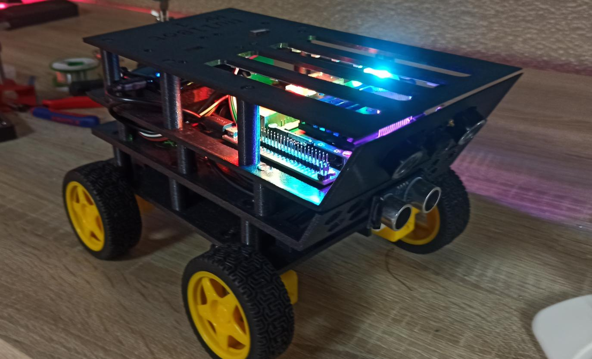
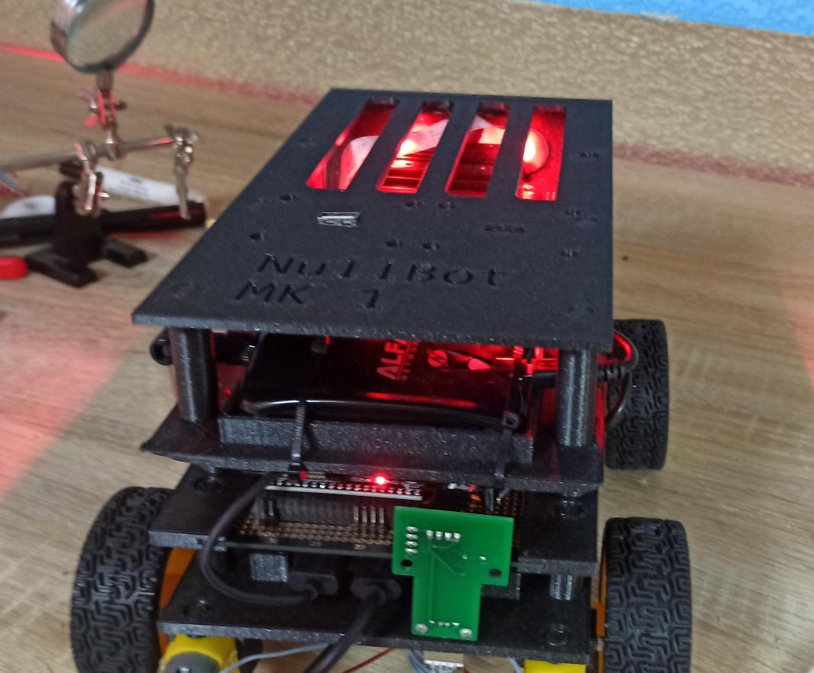

# NullBot Mark 1
Current Todo:
* Ultrasonic Sensor programming
* mainboard pcb schematic
* other modules
* documentation

# About
This is a modifiable AI robot project using a Jetson Nano at its core. It is designed to be easy to build (it just snaps together with no glue required) and easy to modify. This can be done with modules, which connect to a shared bus system and can be accessed very easily. Everything except the base is considered a module. The tires in the images also are a module. The robot features easy camera control and an AI-stack, which makes it easy to use many neural nets on the bot.

### **Features**:
* Jetson Nano as a core for stable control and AI capabilities.
* ESP-32 coprocessor to handle the module bus and other parts of the bot.
* Wifi antenna
* Infrared camera
* Big battery
* Ultrasonic distance sensor
* RGB lighting
* Everything else that can be done with modules

### **Modules**:
Modules play a special role in this project. Everything aside the main body is considered a module. Two modules can be attached to the top and one to the bottom, as well as one directly to the main board. I have remapped a USB connection for easier attachment.

Available modules include (unchecked boxes are to-do):

- [x] Drive Module (attached in pictures)
- [x] Dev Module (create custom modules)
- [ ] LiDAR module
- [ ] BME680
- [ ] LoRA module

The modules I make in this project are located in `modules.py`. An example script for controlling the wheels of an attached drive module:
```python
from nullbot import modules

# the script will panic if the module is not physically attached
bot = modules.DriveModule()

# drive forward for one second
bot.forward(1)
```
### **Camera**:
The camera in this project is a normal IR camera compatible with raspberry pi. You can register a callback function which takes a PIL image as parameter, which will then be executed as a LoopThread (watchdog). The camera can also be a target in the AI Stack.
### **AI Stack**:
The Jetson Nano contains CUDA-cores, whch can be used for accelerated neural networks. To run many models easy and with the same resources, the nullbot contains an *AI Stack*. Models / Wrapper Models that inhertit `StackNetwork` from ai.py can be put onto the AI stack. There are two types of stack, an image stack and a misc stack. The Image stack can use models that take a PIL Image as parameter, other models can be put onto another stack. With `run_stack(*args)` you can run a stack, for example as callback frunction for the camera, which returns an Image. The stack determins by itself, if it should use the image or misc stack. If activated, the bot will run the `ai_stack` function. The stack can be for example used with an avoidance network. An example code for the AI stack:
```python
from nullbot import ai, camera
from PIL import Image

class MyModel(ai.StackNetwork):
    # This is an image stack network
    image = True

    def __init__(self) -> None:
        # your neural net here
        pass

    def ai_stack(self, img:Image) -> None:
        # do some inference here
        pass

model = MyModel()
ai.add_to_stack(model)
camera.camera_with_callback(ai.run_stack)
```
### **WatchDog**:
When the bot is running, it is important, that crashing tasks dont interrupt the whole bot. For that purpose the bot has LoopThreads. Example code:
```python
from nullbot import watchdog
from time import sleep

def test():
    print("ping")
    sleep(1)

thread = watchdog.LoopThread(target=test, daemon=True, name="Example Thread")
thread.start()
```
## Hardware
The case is 3d printed (stl files in `hardware/stl`)

Needed materials:
* Jetson Nano
* Infrared Camera
* Alfa Wifi Adapter
* ESP32
* NullBot Junction PCBs
* WS2812 LEDs
* Ultrasonic sensor
* Battery Pack
* other small stuff

## Software
To set up nullbot Jetson Nano:
1. Flash the [JetPack](https://developer.nvidia.com/embedded/jetpack) image
2. Install neede python packages onto the jetson nano
3. You have to build OpenCV with Gstreamer support from source
4. copy [the nullbot package](software/JetsonCore/nullbot/) to python site-packages directory

To set up nullbot ESP32 coprocessor:
1. Install [ESP-IDF](https://docs.espressif.com/projects/esp-idf/en/latest/esp32/get-started/index.html)
2. go to [the coprocessor source](software/ESPHelper)
3. `get_idf`
4. `idf.py menuconfig`
5. go to Component config -> i2c master config
6. set sda and scl pin
7. go to Serial flasher config and set flash size
8. exit and save
9. `idf.py -p /dev/ttyUSB0 flash`

# Available Modules
## Drive Module
The drive module uses two H-bridges and a Pi Pico microcontroller as main chip. The default i²c address is `0x56`.
## Dev Module
The dev module uses an ESP32 as processor and can be used to prototype custom modules very easy. Up until now libraries are only available for ESP-IDF and Pico SDK, an Arduino Library in on the way.

## Images
---
Assembled Bot with Drive Module



Drive Module


RGB lighting

Prototyping and programming (white prototype)

